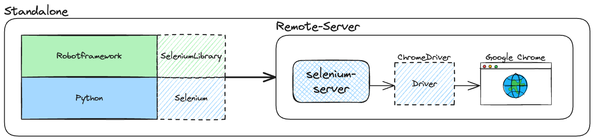
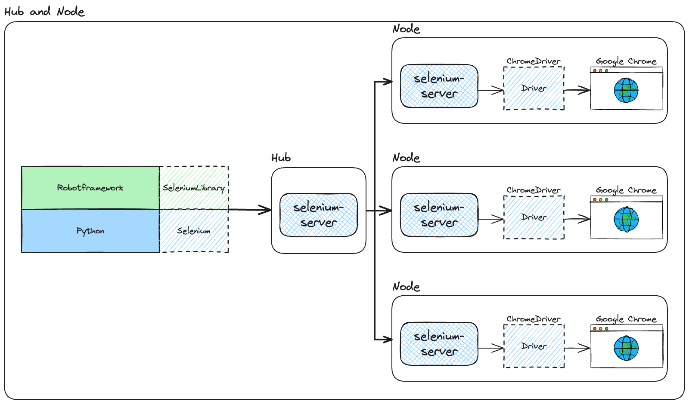
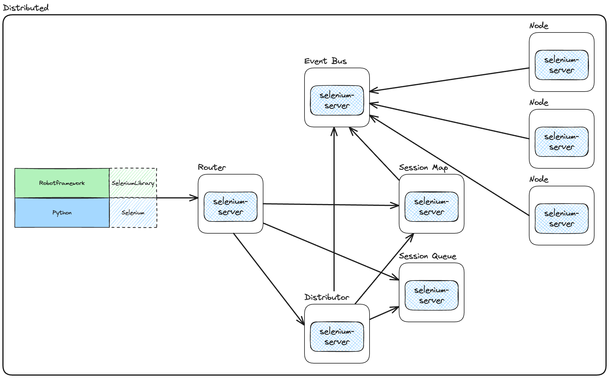

# Parallel

## Pabot

- Suite1.robot

  ```robot
  *** Test Cases ***
  Test Case 1
      Log    Test Case 1
      Sleep   5s

  Test Case 2
      Log    Test Case 2
      Sleep   5s

  Test Case 3
      Log    Test Case 3
      Sleep   5s
  ```

- Suite2.robot

  ```robot
  *** Test Cases ***
  Test Case 4
      Log    Test Case 4
      Sleep   5s

  Test Case 5
      Log    Test Case 5
      Sleep   5s

  Test Case 6
      Log    Test Case 6
      Sleep   5s
  ```

  ```sh
  robot .
  ```

  ```sh
  pip install -U robotframework-pabot
  ```

  ```sh
  pabot .
  ```

  ```sh
  pabot --testlevelsplit
  ```

  ```sh
  pabot --testlevelsplit --processes 8
  ```

- Suite3.robot

  ```robot
  *** Settings ***
  Test Setup    Setup
  Test Teardown    Teardown

  *** Test Cases ***
  Test Case 1
      Log    Test Case 1
      Sleep   5s

  Test Case 2
      Log    Test Case 2
      Sleep   5s

  Test Case 3
      Log    Test Case 3
      Sleep   5s

  *** Keywords ***
  Setup
      Log    Test Setup

  Teardown
      Log    Teardown
  ```

- Suite4.robot

  ```robot
  *** Settings ***
  Library    DateTime
  Library    String
  Suite Setup    Setup All
  Suite Teardown    Teardown All
  Test Setup    Setup
  Test Teardown    Teardown

  *** Test Cases ***
  Test Case 1
      Log    Test Case 1
      Sleep   5s

  Test Case 2
      Log    Test Case 2
      Sleep   5s

  Test Case 3
      Log    Test Case 3
      Sleep   5s

  *** Keywords ***
  Setup All
    ${date} =    Get Current Date
    ${random} =    Generate Random String    4    [NUMBERS]
    Log    Test Setup All: ${random}, ${date}
    VAR    ${RANDOM}    ${random}    scope=SUITE

  Teardown All
      ${date} =	Get Current Date
      Log    Teardown All: ${RANDOM}, ${date}

  Setup
      ${random} =    Generate Random String    4    [NUMBERS]abc
      Log    Test Setup: ${random}
      VAR    ${test_random}    ${random}    scope=TEST

  Teardown
      Log    Teardown: ${test_random}
  ```

## Selenium Grid







1. Setup Selenium Grid

2. Setup Remote URL

   ```robot
   *** Variables ***
   ${URL}    https://dminer.in.th/
   ${BROWSER}    firefox
   ${REMOTE_URL}    None

   *** Test Cases ***
   ...

   *** Keywords ***
   เปิดหน้า Login
       Open Browser    url=${URL}    browser=${BROWSER}    remote_url=${REMOTE_URL}
   ```

3. Run with `robot`

   ```sh
   robot -v REMOTE_URL:http://127.0.0.1:4444/wd/hub 04_invalid_login.robot 05_invalid_login.robot
   ```

4. Run with `pabot`

   ```sh
   pabot -v REMOTE_URL:http://127.0.0.1:4444/wd/hub 04_invalid_login.robot 05_invalid_login.robot
   ```

   ```sh
   pabot --testlevelsplit -v REMOTE_URL:http://127.0.0.1:4444/wd/hub 04_invalid_login.robot 05_invalid_login.robot
   ```

   ```sh
   pabot --testlevelsplit  --processes 8 -v REMOTE_URL:http://127.0.0.1:4444/wd/hub 04_invalid_login.robot 05_invalid_login.robot
   ```
