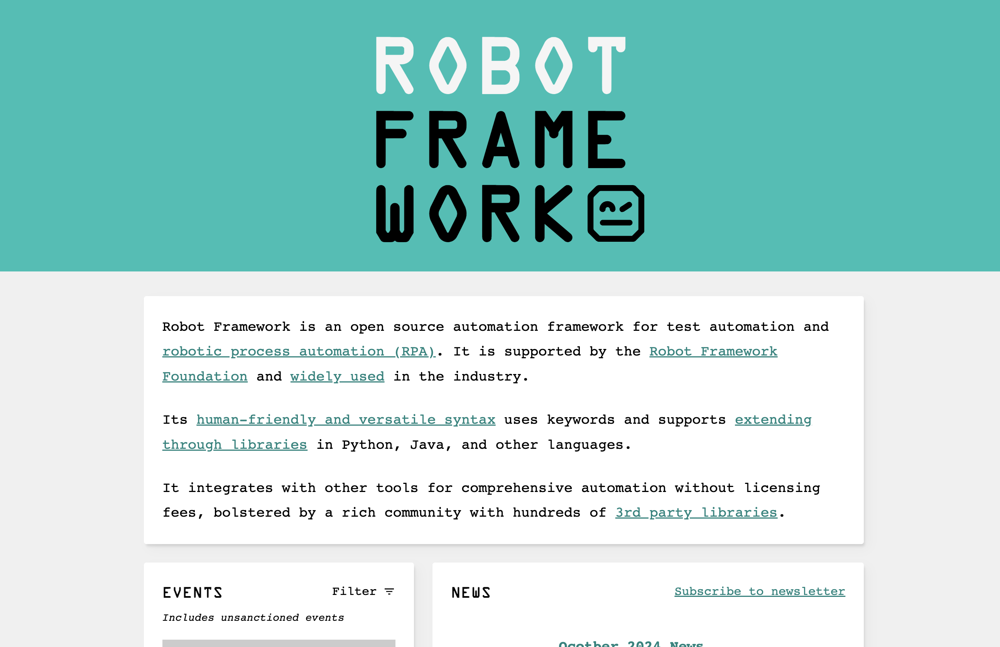
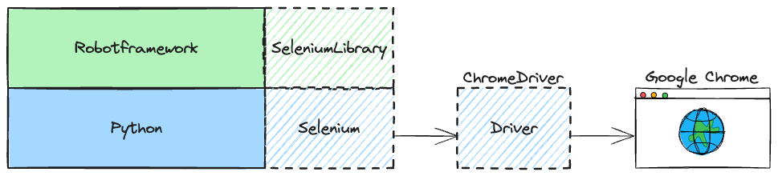

# Robotframework-Seleniumlibrary Part 01

## Robotframework



Robot Framework is an open-source automation framework that is used for test automation and robotic process automation (RPA). It is keyword-driven, meaning that it uses keywords to abstract the details of the tests, making them more readable and maintainable. Robot Framework is highly extensible and can be integrated with various libraries and tools, such as SeleniumLibrary for web testing.

Key features of Robot Framework include:

- `Keyword-driven testing`: Tests are written using keywords, which can be user-defined or come from external libraries.
- `Extensibility`: Supports custom libraries and tools, allowing for a wide range of testing scenarios.
- `Data-driven testing`: Allows for running the same test with different sets of input data.
- `Clear and readable syntax`: Uses a simple, readable syntax that makes it easy to write and understand tests.

---

### 1.Robotframework's Flow

| Flow       |
| ---------- |
| Setup      |
| `Act`      |
| `Validate` |
| TearDown   |

### 2.Test Data Sections

```robot
*** Settings ***


*** Variables ***


*** Test Cases ***


*** Keywords ***

```

| Section                                                                            | Used for                                                                                                                            |
| :--------------------------------------------------------------------------------- | :---------------------------------------------------------------------------------------------------------------------------------- |
| [Settings](https://docs.robotframework.org/docs/style_guide#settings)              | 1) Importing `test libraries`, `resource files` and `variable files`. <br/>2) Defining metadata for `test suites` and `test cases`. |
| [Variables](https://docs.robotframework.org/docs/style_guide#variables)            | Defining `variables` that can be used elsewhere in the test data.                                                                   |
| [Test Cases](https://docs.robotframework.org/docs/style_guide#test-cases-or-tasks) | `Creating test cases` from available keywords.                                                                                      |
| [Keywords](https://docs.robotframework.org/docs/style_guide#keyword)               | `Creating user keywords` from existing lower-level keywords                                                                         |

---

## Robotframework-Selenium

Web testing library that uses popular Selenium tool internally.



### Selenium Example

```py
from selenium import webdriver

def test_web_form_title():
   driver = setup()

   title = driver.title
   assert title == "Web form"


def setup():
   driver = webdriver.Chrome()
   driver.get("https://www.selenium.dev/selenium/web/web-form.html")
   return driver

def teardown(driver):
   driver.quit()
```

### Robotframework-Selenium Example

```robot
*** Settings ***
Library    SeleniumLibrary

*** Test Cases ***
Test Web Form Title
   Open Browser    https://www.selenium.dev/selenium/web/web-form.html    chrome
   Title Should Be    Web form
```
