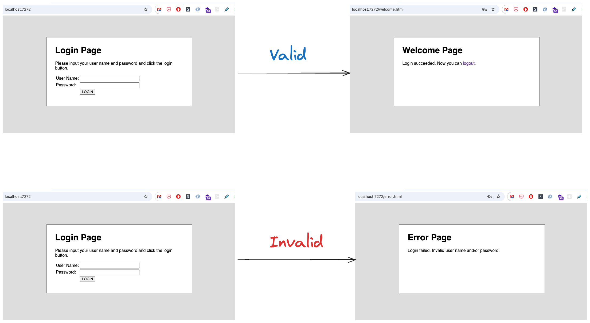

# Robotframework-Seleniumlibrary Part 02

## Test Scenarios



1. Happy cases

   | Test Case                   | Username | Password |
   | --------------------------- | -------- | -------- |
   | Valid Username And Password | demo     | mode     |

2. Alternative cases

   | Test Case                     | Username | Password |
   | ----------------------------- | -------- | -------- |
   | Invalid Username              | invalid  | mode     |
   | Invalid Password              | demo     | invalid  |
   | Invalid Username And Password | invalid  | whatever |
   | Empty Username                |          | mode     |
   | Empty Password                | demo     |          |
   | Empty Username And Password   |          |          |

## In Action

1. Create file call `valid_login.robot` with following code

   ```robot
   *** Settings ***


   *** Variables ***


   *** Test Cases ***
   Valid Username And Password


   *** Keywords ***

   ```

   > [robotframework-seleniumlibrary](https://robotframework.org/SeleniumLibrary/SeleniumLibrary.html)

2. Run Test

   ```sh
   robot valid_login.robot
   ```

## Keywords

Keywords Section: `Creating user keywords` from existing lower-level keywords

```robot
*** Settings ***
Library    SeleniumLibrary

*** Variables ***


*** Test Cases ***
Valid Username And Password
    เปิดหน้า Login
    ใส่ Username
    ใส่ Password
    กดปุ่ม
    จะต้องเห็นข้อความ Welcome Page
    ปิด Browser

*** Keywords ***

```

## In Action

1. Create User Keywords `เปิดหน้า Login`

   ```robot
   *** Test Cases ***
   Valid Username And Password
       เปิดหน้า Login
       ใส่ Username
       ใส่ Password
       กดปุ่ม
       จะต้องเห็นข้อความ Welcome Page
       ปิด Browser


   *** Keywords ***
   เปิดหน้า Login

   ```

2. Run Test

   ```sh
   robot valid_login.robot
   ```

3. Create User Keywords `ตรวจสอบผลการค้นหา`

   ```robot
   *** Keywords ***
   เปิดหน้า Login
      ...

   ใส่ Username
      ...
   ```

4. Run Test

   ```sh
   robot valid_login.robot
   ```

5. Create `User Keyword Arguments`

   ```robot
   *** Keywords ***
   เปิดหน้า Login
      ...

   ใส่ Username
      [Arguments]    ${username}
      ...
   ```

6. Run Test

   ```sh
   robot valid_login.robot
   ```

## Variables

1. Create Variable call `URL`

   ```robot
   *** Settings ***
   Library    SeleniumLibrary

   *** Variables ***
   ${URL}
   ```

2. Run Test

   ```sh
   robot valid_login.robot
   ```

3. Run Test with `-v`

   ```sh
   robot -v URL:https://www.dminer.in.th valid_login.com
   ```

---

## Implement `Alternative cases`

1. Create file call `invalid_login.robot` with following code

   ```robot
   *** Settings ***


   *** Variables ***


   *** Test Cases ***
   Invalid Username


   *** Keywords ***

   ```
