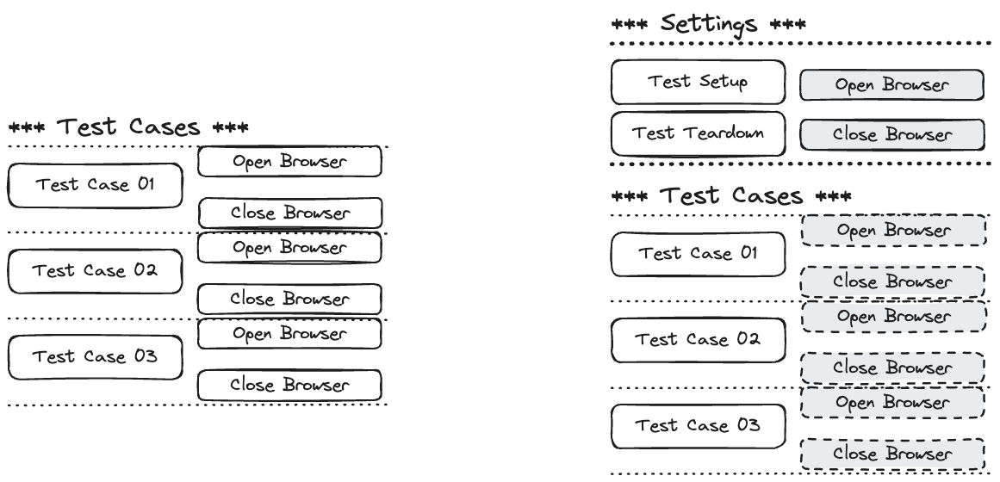
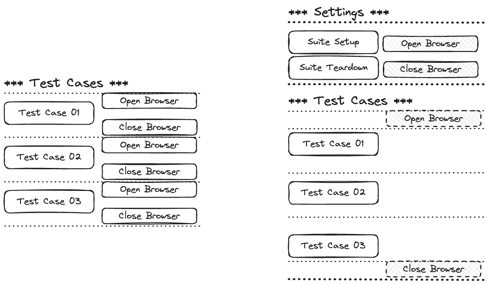
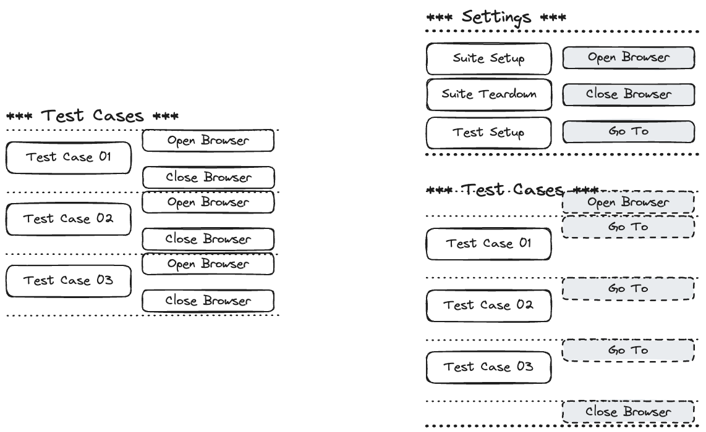

# Robotframework-Seleniumlibrary Part 03

## Test Setup/Test Teardown



### In Action

1. Create file call `valid_login_test_setup.robot` (copy from `valid_login.robot`)
2. Remove `เปิดหน้า Login` และ `ปิด Browser` from `Test Case`

3. Remove `เข้า google` keyword from `ค้นหาด้วยคำค้น` keyword
4. Set `Test Setup` and `Test Teardown` at `*** Settings ***`

   ```robot
   *** Settings ***
   Library             SeleniumLibrary

   Test Setup          เปิดหน้า Login
   Test Teardown       ปิด Browser
   ```

5. Run Test

   ```sh
   robot valid_login_test_setup.robot
   ```

### Implement Test Setup and Test Teardown for `Alternative Cases`

1. Create file call `invalid_login_test_setup.robot` (copy from `valid_login.robot`)

---

## Suite Setup/Suite Teardown



1. Create file call `valid_login_suite_setup.robot` (copy from `valid_login.robot`)
2. Split `เปิดหน้า Login` keyword into following keywords `เปิด Browser` and `เข้าหน้า Login`

   ```robot
   *** Keywords ***
   เปิดหน้า Login

   เปิด Browser
      Open Browser    browser=chrome

   เข้าหน้า Login
      Go To    ${URL}
   ```

3. Replace `เปิดหน้า Login` with `เข้าหน้า Login` at `Valid Username And Password`

   ```robot
   *** Test Cases ***
   Valid Username And Password
       เข้าหน้า Login
       ใส่ Username
       ...
   ```

4. Remove `ปิด Browser` from `Valid Username And Password`

5. Set `Suite Setup` and `Suite Teardown` at `*** Settings ***`

   ```robot
   *** Settings ***
   Library             SeleniumLibrary

   Suite Setup         เปิด Browser
   Suite Teardown      ปิด Browser
   ```

6. Remove `เปิดหน้า Login` keyword
7. Run Test

   ```sh
   robot valid_login_suite_setup.robot
   ```

### Implement Suite Setup and Suite Teardown for `Alternative Cases`

1. Create file call `invalid_login_suite_setup.robot` (copy from `valid_login.robot`)

---

## Suite Setup, Suite Teardown, Test Setup, Test, Teardown



1. Implement `valid_login_suite_test_setup_teardown.robot`
2. Implement `invalid_login_suite_test_setup_teardown.robot`

---

## Test Templates

Test templates convert normal `keyword-driven` test cases into `data-driven` tests. Whereas the body of a keyword-driven test case is constructed from keywords and their possible arguments, test cases with template contain only the arguments for the template keyword. Instead of repeating the same keyword multiple times per test and/or with all tests in a file, it is possible to use it only per test or just once per file.

### 1.[Template]

```robot
*** Test Cases ***
Valid Username And Password
   [Template]    Login
   demo    mode    Welcome Page


*** Keywords ***
Login
   [Arguments]    ${username}    ${password}    ${expected_message}
   ใส่ Username    ${username}
   ใส่ Password    ${password}
   กดปุ่ม
   จะต้องเห็นข้อความ     ${expected_message}
```

#### In Action

1. Create file call `valid_login_template.robot` (copy from `valid_login_suite_test_setup_teardown.robot`)
2. Create User Keywords `Login`

   ```robot
   *** Keywords ***
   Login
      [Arguments]    ${username}    ${password}    ${expected_message}
      ใส่ Username    ${username}
      ใส่ Password    ${password}
      กดปุ่ม
      จะต้องเห็นข้อความ     ${expected_message}

   ```

3. Remove All Keywords from `Valid Username And Password` Test Case
4. Add `[Template]    Login`

   ```robot
   *** Test Cases ***
   Valid Username And Password
      [Template]    Login
      demo    mode    Welcome Page
   ```

5. Run Test

   ```sh
   robot valid_login-template.robot
   ```

#### Implement [Template] for `Alternative Cases`

1. Create file call `invalid_login_template.robot` (copy from `invalid_login_suite_test_setup_teardown.robot`)

---

### 2.Test Template

```robot
*** Settings ***
Library             SeleniumLibrary

Test Template       Login

*** Test Cases ***    username    password    expected_message
Valid Login           demo        mode        Welcome Page


*** Keywords ***
Login
   [Arguments]    ${username}    ${password}    ${expected_message}
   ใส่ Username    ${username}
   ใส่ Password    ${password}
   กดปุ่ม
   จะต้องเห็นข้อความ     ${expected_message}
```

#### In Action

1. Create file call `valid_login_test_template.robot` (copy from `valid_login_suite_test_setup_teardown.robot`)
2. Create User Keywords `Login`

   ```robot
   *** Keywords ***
   Login
       [Arguments]    ${username}    ${password}    ${expected_message}
       ใส่ Username    ${username}
       ใส่ Password    ${password}
       กดปุ่ม
       จะต้องเห็นข้อความ     ${expected_message}
   ```

3. Remove All TestCases
4. Add new testcase

   ```robot
   *** Test Cases ***    username    password    expected_message
   Valid Login           demo        mode        Welcome Page
   ```

5. Set `Test Template` at `Settings` Section

   ```robot
   *** Settings ***
   Library             SeleniumLibrary

   Test Template       Login
   ```

6. Run Test

   ```sh
   robot valid_login_test_template.robot
   ```

#### Implement `Test Template` for `Alternative Cases`

1. Create file call `invalid_login_test_template.robot` (copy from `invalid_login_suite_test_setup_teardown.robot`)

---

## Resources

1. Create file call `valid_login_resource.robot` (copy from `valid_login_test_template.robot`)
2. Create file call `invalid_login_resource.robot` (copy from `invalid_login_test_template.robot`)
3. Create file call `keywords.resource`
4. At `valid_login_resource.robot` Move `Library     SeleniumLibrary` to `keywords.resource`
5. At `valid_login_resource.robot` Move `Keywords Section` to `keywords.resource`
6. At `valid_login_resource.robot` Move `Variables Section` to `keywords.resource`
7. Add `Resource    keywords.resource` to `Settings`'s Sections At At `valid_login_resource.robot`

   ```robot
   *** Settings ***
   Resource    keywords.resource

   ```

8. Run Test

   ```sh
   robot valid_login_resource.robot
   ```

9. Remove `Keywords Section` from `invalid_login_resource.robot`
10. Remove `Variables Section` from `invalid_login_resource.robot`
11. Remove `Library     SeleniumLibrary` from `invalid_login_resource.robot`
12. Add `Resource    keywords.resource` to `Settings`'s Sections At At `invalid_login_resource.robot`
