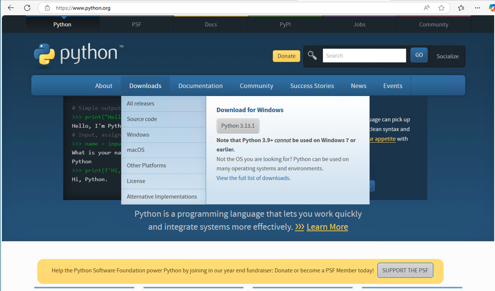
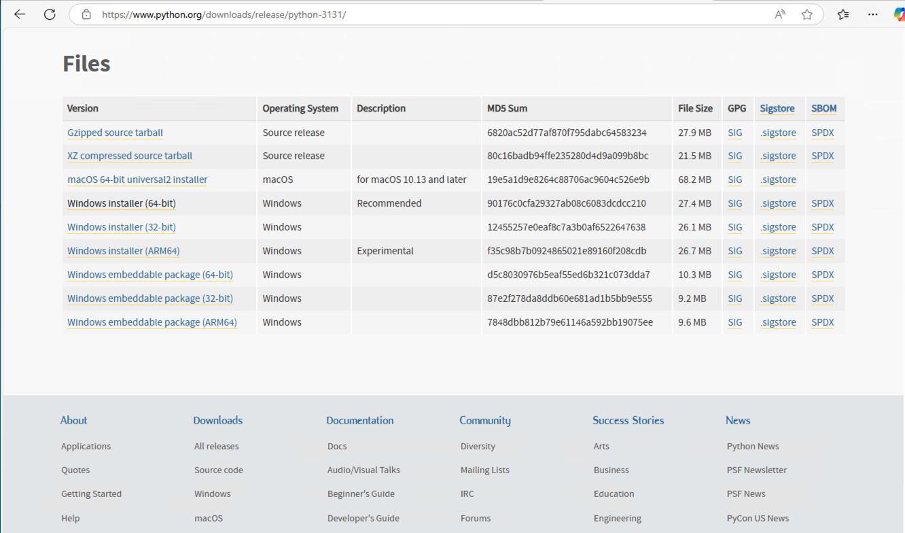
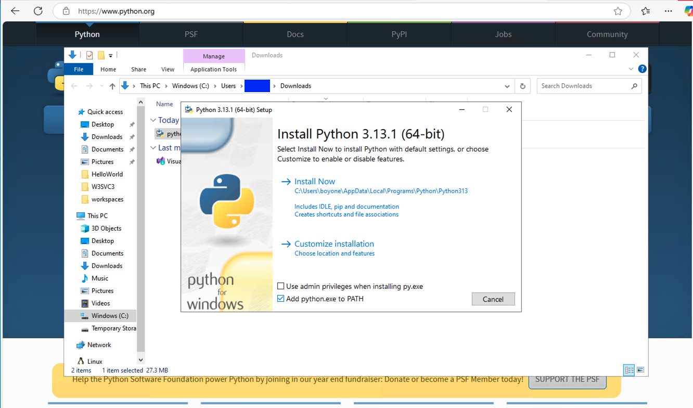
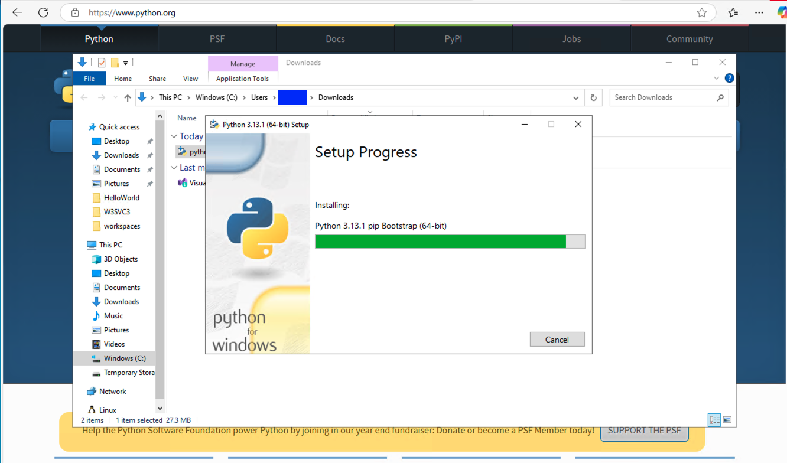
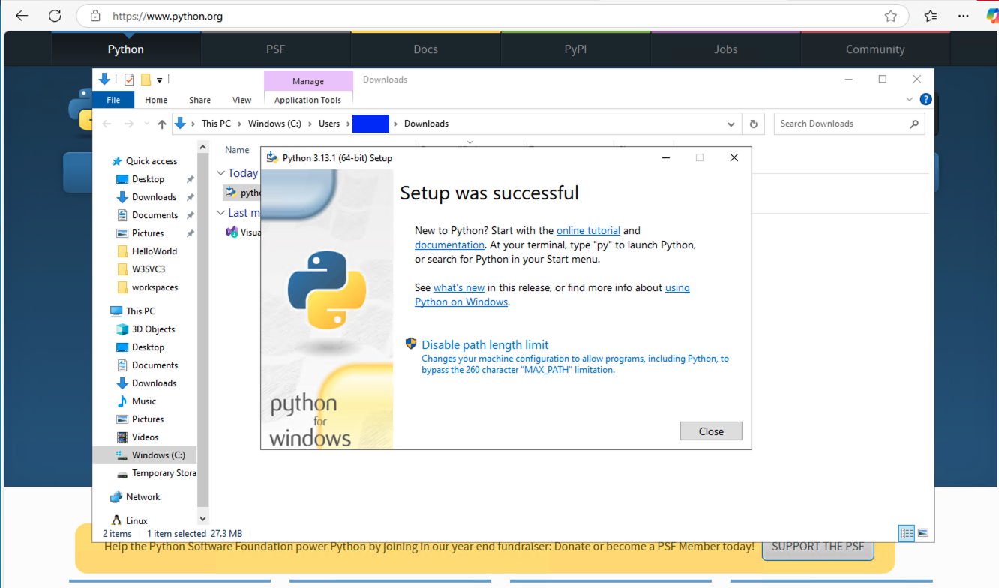

# Install Python and Setup Pip

1. [Install Python](#1-install-python)
   1. [Install Python on Windows](#11-install-python-on-windows)
   2. [Install Python on macOS](#12-install-python-on-macos)
2. [Check Python Installation](#2-check-python-installation)
3. [Check Pip Installation](#3-check-pip-installation)

---

## 1. Install Python

### 1.1. Install Python on Windows

1. Download python installer(2 choices)
   1. [download via python.org first page -> Downloads -> Python 3.13.1](https://www.python.org)
      
   2. [download via python:3.13.1 page](https://www.python.org/downloads/release/python-3131/)
      
2. Install with `Add python.exe to PATH`
   
   
   

### 1.2. Install Python on macOS

1. Install (HomeBrew)[https://brew.sh/]
2. Install python by homebrew

   ```sh
   brew install python@3.13
   ```

## 2. Check Python Installation

1. Run Command

   ```sh
   python --version
   ```

2. Result

   ```sh
   Python 3.13.1
   ```

## 3. Check Pip Installation

1. Run Command

   ```sh
   pip --version
   ```

2. Result

   ```sh
   pip 24.3.1 from ... (python 3.13)
   ```
